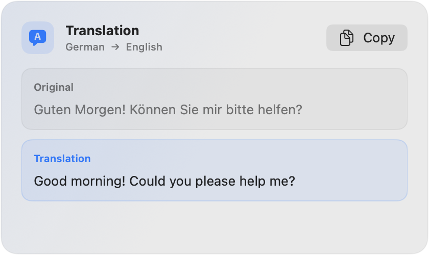

# Verba

Translate and proofread selected text without leaving the app you are using.

Verba lives in the macOS menu bar. Select text in any app, press a shortcut, and a small result window appears near your pointer. Copy the result when you are ready and carry on with your work.

## What Verba can do

- **Translate text on your Mac.** Choose a target language and translate with Apple's built-in Translation framework.
- **Proofread your writing.** Use your own OpenAI API key to correct spelling and grammar, with a short explanation of any changes.
- **Work across apps.** Use Verba in Mail, Notes, Safari, text editors, and other apps where you can select text.
- **Stay out of the way.** Verba does not replace your text automatically or keep a history. You decide when to copy a result.

## Get started

1. Download the latest notarized version from [Releases](../../releases/latest), unzip it, and move Verba to Applications.
2. Open Verba and follow the setup guide. macOS will ask for Accessibility permission so Verba can read text you select in other apps.
3. Choose your translation language. Proofreading is optional and can be set up with your OpenAI API key.
4. Select some text and use a shortcut:
   - **Control-Option-T** to translate
   - **Control-Option-P** to proofread

You can change the language and both shortcuts in Settings.

## Privacy at a glance

Translation runs through Apple's Translation framework on your Mac. Proofreading sends only the text you selected to OpenAI, and only when you ask Verba to proofread it. Your OpenAI API key is stored in macOS Keychain.

Verba has no accounts, advertising, analytics, selected-text history, or cloud synchronization. Read [Privacy and data handling](PRIVACY.md) for the full details.

## Requirements

- macOS 15 or later
- A Mac with Apple silicon
- An OpenAI API key and internet connection for proofreading only
